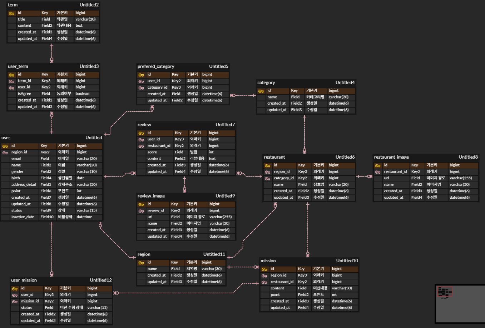

# 실습. DB 연결 확인

# 미션 1. 제 1, 2, 3정규화를 고려한 ERD 설계

## ERD 설계 결과물

## 정규화란?
관계형 데이터베이스를 설계하는 과정에서 중복을 최소화하고 데이터의 무결성을 유지하기 위해, 데이터를 적절한 구조로 분리하는 과정을 말한다.

## 정규화 단계
### 제 1 정규화 : 각 컬럼이 원자적인 값을 가지도록 보장해야한다.

#### 1 정규화를 적용한 예시
    - 사용자는 회원가입 시, 선호하는 음식 카테고리를 여러개 선택할 수 있다.
    - 식당 또한 음식 카테고리를 가진다.
위 요구사항을 반영해 ERD를 설계할 때, 아래처럼 사용자 테이블과 식당 테이블에서 카테고리를 각각 관리한다면 어떻게 될까?

- 문제점
  - 사용자가 선호하는 카테고리가 여러 가지인 경우, 한 컬럼에 여러 개의 값이 들어간다.
  - 사용자와 식당 모두 중복된 음식 카테고리를 저장한다.
  - 카테고리만 추가하고 싶은데, 사용자나 식당 정보가 없으면 삽입이 불가능하다.
  - 반대로 카테고리만 삭제하고 싶은데, 사용자나 식당 정보를 함께 삭제해야 한다.
  
- 해결
  - 카테고리 테이블을 따로 분리하여 관리한다.
  - 사용자는 여러 카테고리를 선호할 수 있으므로 prefered_category를 추가하여 다대다 관계를 1:N과 N:1로 풀어주었다.

### 제 2 정규화 : 제 1정규형을 만족하며 특정 컬럼이 복합키의 일부에 종속되어선 안된다.

#### 2 정규화의 적용
    - 식당은 여러 미션을 등록할 수 있다.
    - 사용자는 여러 미션을 수행할 수 있다.
결과물 ERD에서는 JPA의 자동 생성 단일키를 고려하여 문제가 없으나, 만약 복합키를 사용해 설계해야 한다면 어떤 경우 2정규형에 위배될까?

- 문제점
  - 식당이 등록한 미션 정보인 'content', 'point'는 식당 정보만으로 알아내기 충분하다.
  - 미션만 따로 추가하거나 삭제하기가 어렵다.

- 해결
  - 미션 테이블을 따로 분리한다.
  - 사용자가 미션을 수행하는 행위는 중간 테이블인 user_mission 으로 나타낸다.

### 제 3 정규화 : 제 2정규화를 만족하며 이행적 함수 종속이 없어야 한다. 즉, a->b, b->c 관계에서 a->c 관계가 있으면 안된다.

#### 3 정규화의 적용
    - 미션 상태를 관리하는 테이블인 user_mission에서 식당의 정보를 가지고 있는 경우

  
- 문제점
  - user_mission -> mission, mission -> restaurant 관계에서 user_mission -> restaurant 관계가 존재한다.

- 해결
  - user_mission 에서 불필요한 restaurant_id 컬럼을 삭제한다.

# 미션 2. 중복 요청 처리 방지

- 중복 요청의 발생 원인
  - 사용자의 네트워크가 지연되어 응답이 지연되는 경우
  - 서버에 발생하는 부하로 인해 응답이 지연되는 경우

- 해결 과정
  - 중복 요청에 대해 '멱등성'을 보장해야한다.
  - 멱등성이란 첫 번째 수행을 한 뒤 여러 차례 실행해도 결과를 변경시키지 않는 특성을 말한다.

- 방안 1. 요청 정보를 기반으로 생성한 식별키(멱등키)를 데이터베이스에 저장한 뒤, 중복을 처리한다.
  - 멱등키 저장소로는 인메모리 기반의 DB를 주로 사용한다. 그 이유는 다른 데이터와 관계가 없으며, 여러번의 동시 요청을 RDB에 저장하는 경우 다른 api 성능에 영향을 미칠 수 있다.
  - 멱등키에 대한 TTL 설정이 가능하다. 이를 통해 일정 시간동안 오는 동일한 요청을 예외로 처리할 수 있다.
  - 레디스의 set 자료구조를 활용한다.
  - 주의점 : 비즈니스 로직 이후에 멱등키 세팅 로직을 작성한다.
    - 멱등키 세팅을 우선한다면 비즈니스 예외 발생 시, TTL 설정 시간동안 재시도를 못하기 때문이다.

- 방안 2. db의 컬럼을 조합해 unique 필드를 만들고, 중복이 발생하면 예외를 반환하도록 한다.
  - @UniqueConstraint

- 방안 3. 클라이언트 측에서 식별자 값을 생성해 넘기도록 한다.
  - 즉, PK 생성을 클라이언트로 위임한다.
  - 식별자 값의 유일성에 대한 책임이 클라이언트로 넘어간다.