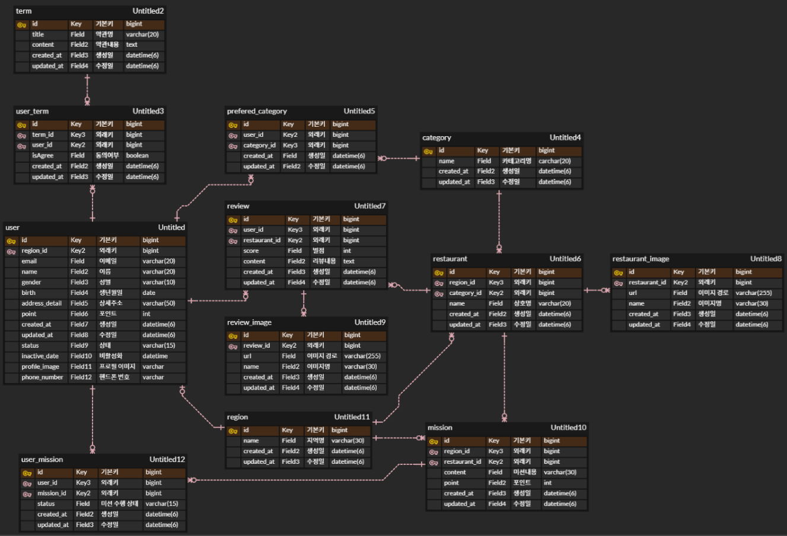
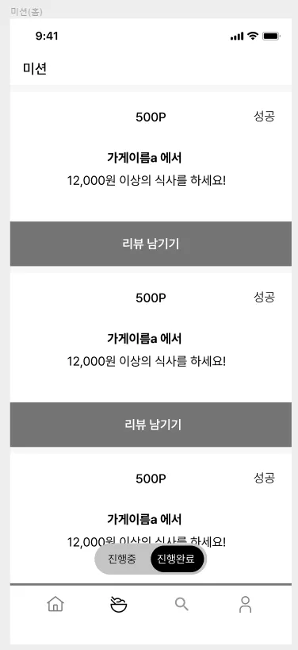
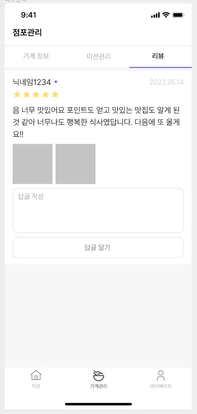
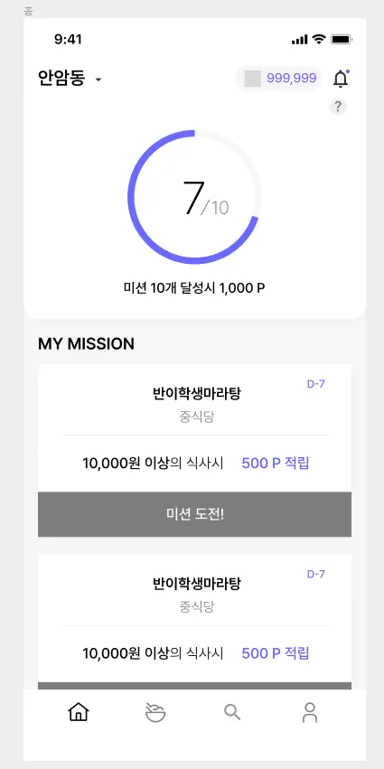

# 설계 ERD


# 미션 1. 페이징을 적용하여 내가 진행중/진행완료한 미션 모아보기

```sql
SELECT um.restaurant_id, r.name, m.content, m.point, um.status
FROM user_mission AS um
JOIN mission as m ON m.id = um.mission_id
JOIN restaurant as r ON r.id = m.restaurant_id
WHERE um.user_id = :user_id AND um.status = :status
ORDER BY um.updated_at DESC
limit 5 offset (:page - 1) * 5;
```
- API 호출 시, 입력 파라미터로 user_id와 status(미션 수행상태)를 받도록 의도
- user_mission + mission + restaurant를 결합
- 가게의 식별자 값, 가게명, 미션 내용, 포인트를 선택
- 내림차순 정렬

# 미션 2. 리뷰를 작성하는 쿼리, 사진을 일단 제외

```sql
INSERT INTO review (
    user_id,
    restaurant_id,
    score,
    content
)
VALUES (
   :user_id,
   :restaurant_id,
   :score,
   :content
);
```
- 유저 식별자, 레스토랑 식별자, 별점, 리뷰내용을 입력받도록 의도
- 사진은 여러장 등록이 가능하니, review_image 테이블에 따로 넣으면 될 것 같다.

# 미션 3. 홈 화면 쿼리 (현재 선택 된 지역에서 도전이 가능한 미션 목록, 페이징 포함)

```sql
SELECT count(*)
FROM user_mission AS um
JOIN mission AS m ON m.id = um.mission_id
JOIN region AS r ON r.id = m.region_id
WHERE um.user_id = :user_id AND um.status = 'COMPLETED' AND r.name = :지역명
```
```sql
SELECT m.id, r.name, m.content, m.point, m.deadline
FROM mission AS m
JOIN restaurant AS r ON r.id = m.restaurant_id
WHERE m.id NOT IN (SELECT mission_id FROM user_mission WHERE member_id = :member_id)
ORDER BY m.created_at DESC
limit 5 offset (:page - 1) * 5;
```
- 지역 식별자, 유저 식별자를 받도록 의도
- 카운트 쿼리와 미션 조회(페이징) 쿼리를 분리
- 유저가 이미 신청해서 user_mission에 들어가 있는 미션은 서브쿼리로 제외시킴
- 서브쿼리 -> 조인으로 변경한다면 아래처럼 mission + user_mission 결합하여 필터링할 것 같다.
- left join -> |mission|user_mission| -> user_mission이 NULL이면 이미 신청한 미션이므로 제외
```sql
FROM mission AS m
LEFT JOIN user_mission AS um on um.mission_id = m.id AND um.user_id = :user_id
WHERE user_mission != NULL
```

# 미션 4. 마이 페이지 화면 쿼리

```sql
SELECT profile_image, name, email, phone_number, point
FROM user
WHERE id = :id
```
- 기존 ERD에서 USER에 profile_image와 phone_number 필드를 추가해주었다.
- 프로필 확장을 고려한다면 따로 Profile 테이블을 추가하고, User-Profile 1대1 매핑, Profile에서는 profile_image + phone_number + email과 같은 개인정보를 관리할 것 같다.

<hr>

# 시니어 미션 1. 정렬 기준을 1순위는 포인트로 2순위는 최신순으로 하여 Cursor기반 페이징 구현
```sql
SELECT um.restaurant_id, r.name, m.content, m.point, um.status, um.id AS cursor_id
FROM user_mission AS um
         JOIN mission AS m ON m.id = um.mission_id
         JOIN restaurant AS r ON r.id = m.restaurant_id
WHERE um.user_id = :user_id AND um.status = :status
  AND (
    m.point < :cursor_point
        OR (m.point = :cursor_point AND um.created_at > :cursor_created_at)
        OR (m.point = :cursor_point AND um.created_at = :cursor_created_at AND um.id > :cursor_id)
    )
ORDER BY m.point DESC, um.created_at ASC, um.id ASC
limit 5;
```

- 만약 커서를 point나 created_at과 같이 중복발생 가능성이 있는 값으로만 설정한다면?
  - WHERE 절에서 사용되어 계속해서 동일한 값만 조회될 수 있다.
  - 따라서 커서는 반드시 pk와 같이 ‘유니크한 값’을 포함해야 한다.


- 적용 과정
    - 1. cursor_id를 통해 user_mission 레코드를 가져오고, 해당 레코드를 통해 cursor_point와 cursor_created_at을 추출한다.
    - 2. WHERE의 첫번째 조건으로 cursor_point보다 작은 레코드들이 후보군이 되도록 한다.
     ```sql
     m.point < :cursor_point 
     ```
    - 3. 그러나 point는 중복 가능성이 있기 때문에, 만약 동일한 point라면 커서 이후 미션 도전을 한 레코드들을 조회한다.
     ```sql
     OR (m.point = :cursor_point AND um.created_at > :cursor_created_at)
     ```
    - 4. 혹여나, created_at이 ‘연-월-일’ 처럼 관리되어 이 마저도 중복이 발생한다면 cursor_id 이후의 레코드들을 조회한다.
     ```sql
     OR (m.point = :cursor_point AND um.created_at = :cursor_created_at AND um.id > :cursor_id)
     ```
    - 5. 위 과정을 고려하여 ORDER BY를 작성한다.
     ```sql
     // 포인트 우선 -> 최신 도전 우선 -> pk 순서로 정렬
     ORDER BY m.point DESC, um.created_at ASC, um.id ASC
     ```
    - 6. 만약 처음 api를 호출한다면, cursor_id가 null 일테니 WHERE를 제거하고 쿼리를 날리면 될 것 같다.

# 시니어 미션 2. SQL Injection의 발생 원인 및 방지
- SQL Injection
  - 공격자가 악의적인 SQL 쿼리를 입력 필드에 삽입하여 데이터 유출, 변경, 삭제 등의 공격을 시도하는 것을 의미한다.

- 발생 상황
  - 입력 파라미터에 대한 동적 쿼리를 문자열로 직접 만들어 구성하는 경우 발생한다.
  ```sql
  // id와 password 파라미터를 통한 SQL Injection 공격이 가능하다.
  String sql = "SELECT * FROM user WHERE id = '" + param_id + "' AND PW = '" +  param_ passwd + "'";
  stmt = conn.createStatement();
  rs = stmt.executeQuery(sql);
  ```

  - 사용자의 입력 값에 대한 검증이 부족한 경우 발생한다.
  ```sql
  // '1'='1' 과 같이 특수 문자나 길이 제한을 두지 않아 검증이 미흡하면 발생
  String sql = "SELECT * FROM users WHERE name = '" + name + "'";
  ```
  
  - ORM 기술에서도 nativeQuery를 작성하는 경우 발생할 수 있다.
  ```sql
  @Query(value = "SELECT * FROM user WHERE email = '" + email + "'", nativeQuery = true)
  List<User> findByEmail(String email);
  ```
  
- 예방법
  - 입력 파라미터를 받을 때, 특수 문자를 검증한다.
  ```sql
  // 로그인에서 사용자의 이메일을 받을 때, 검증하는 로직을 만들어 예방한다.
  private static final String EMAIL_PATTERN = "^[A-Za-z0-9+_.-]+@([A-Za-z0-9-]+\\.)+[A-Za-z]{2,6}$";

  public boolean validateEmail(String email) {
  return pattern.matcher(email);
  }
  ```
  
  - Prepared Statement를 사용한다. 해당 인터페이스는 입력되는 값을 '' 문자열로 인식하여 안전하다.
  ```
  // 주어진 SQL 및 입력 상황
  String sql = "SELECT * FROM users WHERE username = ? AND password = ?";
  username : admin' --
  password : any value
  ```
  ```sql
  // 1. PreparedStatement 미사용 시 발생하는 문제
     -> 비밀번호가 주석으로 처리되면서 어드민 정보를 비밀번호 없이 탈취 가능
     -> SELECT * FROM users WHERE username = 'admin' --' AND password = '~~~'

  // 2. PreparedStatement 적용
  PreparedStatement pstmt = connection.prepareStatement(sql);
  pstmt.setString(1, username);  // 파라미터 바인딩
  pstmt.setString(2, password);  // 파라미터 바인딩
  ResultSet rs = pstmt.executeQuery();

  // 2-1. PreparedStatement 적용 시, 파라미터 바인딩 과정에서 작은 따옴표가 문자열로 처리되어 주석 X
  SELECT * FROM users WHERE username = 'admin\' --' AND password = '~~~'
  ```