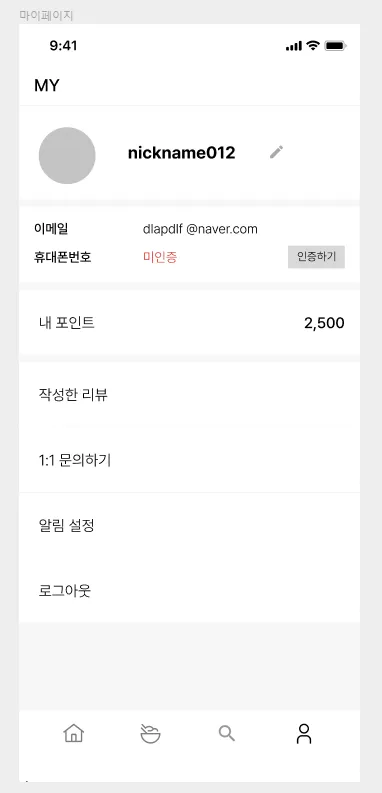

# 설계 ERD


# 미션 1. 페이징을 적용하여 내가 진행중/진행완료한 미션 모아보기

```sql
SELECT um.restaurant_id, r.name, m.content, m.point, um.status
FROM user_mission AS um
JOIN mission as m ON m.id = um.mission_id
JOIN restaurant as r ON r.id = m.restaurant_id
WHERE um.user_id = :user_id AND um.status = :status
ORDER BY um.updated_at DESC
limit 5 offset (:page - 1) * 5;
```
- API 호출 시, 입력 파라미터로 user_id와 status(미션 수행상태)를 받도록 의도
- user_mission + mission + restaurant를 결합
- 가게의 식별자 값, 가게명, 미션 내용, 포인트를 선택
- 내림차순 정렬

# 미션 2. 리뷰를 작성하는 쿼리, 사진을 일단 제외

```sql
INSERT INTO review (
    user_id,
    restaurant_id,
    score,
    content
)
VALUES (
   :user_id,
   :restaurant_id,
   :score,
   :content
);
```
- 유저 식별자, 레스토랑 식별자, 별점, 리뷰내용을 입력받도록 의도
- 사진은 여러장 등록이 가능하니, review_image 테이블에 따로 넣으면 될 것 같다.

# 미션 3. 홈 화면 쿼리 (현재 선택 된 지역에서 도전이 가능한 미션 목록, 페이징 포함)

```sql
SELECT count(*)
FROM user_mission AS um
JOIN mission AS m ON m.id = um.mission_id
JOIN region AS r ON r.id = m.region_id
WHERE um.user_id = :user_id AND um.status = 'COMPLETED' AND r.name = :지역명
```
```sql
SELECT m.id, r.name, m.content, m.point, m.deadline
FROM mission AS m
JOIN restaurant AS r ON r.id = m.restaurant_id
WHERE m.id NOT IN (SELECT mission_id FROM user_mission WHERE member_id = :member_id)
ORDER BY m.created_at DESC
limit 5 offset (:page - 1) * 5;
```
- 지역 식별자, 유저 식별자를 받도록 의도
- 카운트 쿼리와 미션 조회(페이징) 쿼리를 분리
- 유저가 이미 신청해서 user_mission에 들어가 있는 미션은 서브쿼리로 제외시킴
- 만약 조인으로 변경한다면 mission과 user_mission 테이블을 결합하여 필터링할 것 같다.
- left join -> |mission|user_mission| -> user_mission이 NULL이면 이미 신청한 미션이므로 제외
```sql
FROM mission AS m
LEFT JOIN user_mission AS um on um.mission_id = m.id AND um.user_id = :user_id
WHERE user_mission != NULL
```

# 미션 4. 마이 페이지 화면 쿼리

```sql
SELECT profile_image, name, email, phone_number, point
FROM user
WHERE id = :id
```
- 기존 ERD에서 USER에 profile_image와 phone_number 필드를 추가해주었다.
- 프로필 확장을 고려한다면 따로 Profile 테이블을 추가하고, User-Profile 1대1 매핑, Profile에서는 profile_image + phone_number + email과 같은 개인정보를 관리할 것 같다.

