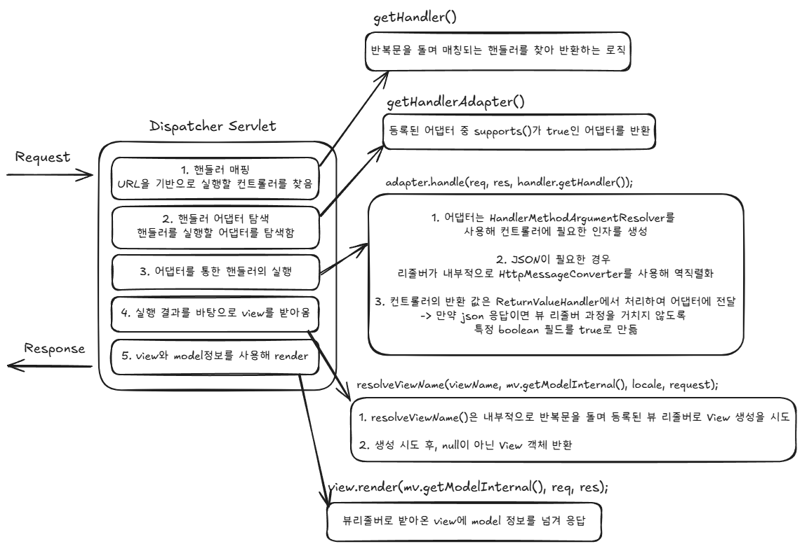
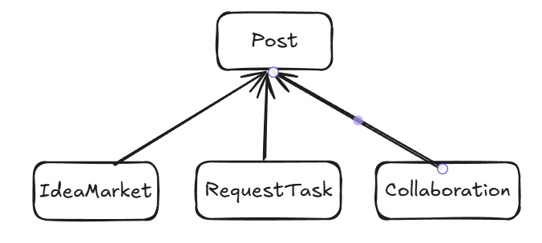

## 미션 1. 서블릿 vs 스프링MVC

- 전통적인 서블릿 방식과 스프링 방식의 비교
  - 요청 처리
    - 서블릿 : HttpServlet을 상속한 뒤, doGet(), doPost() ... 구현
    - 스프링 : @Controller와 @RequestMapping으로 요청 처리
    ```java
    // 서블릿 방식
    public class HelloServlet extends HttpServlet {
        @Override
        protected void doGet(HttpServletRequest req, HttpServletResponse res)
            throws ServletException, IOException {

            resp.setContentType("text/plain");
            resp.getWriter().write("Hello UMC!");
        }
    }
    
    // 스프링 방식
    @Controller
    public class HelloController {
    
        @GetMapping("/hello")
        @ResponseBody
        public String hello() {
            return "Hello UMC!";
        }
    }
    ```
    
  - 라우팅
    - 서블릿 : xml 파일에 url 패턴과 서블릿 클래스를 매핑
    - 스프링 : @GetMapping등의 어노테이션으로 매핑
    ```java
    // 서블릿 방식
    <web-app>
      <servlet>
        <servlet-name>helloServlet</servlet-name>
        <servlet-class>HelloServlet</servlet-class>
      </servlet>
    
      <servlet-mapping>
        <servlet-name>helloServlet</servlet-name>
        <url-pattern>/hello</url-pattern>
      </servlet-mapping>
    </web-app>
    
    // 스프링 방식
    @Controller
    public class HelloController {
    
        @GetMapping("/hello")
        @ResponseBody
        public String hello() {
            return "Hello UMC!";
        }
    }
    ```
    
  - request 파싱
    - 서블릿 : request.getParameter()로 직접 꺼내, 형변환과 예외처리를 직접 해야함
    - 스프링 : @RequestParam(...), @ModelAttribute(...)으로 형변환과 예외처리를 자동으로 할 수 있음
    ```java
    // 서블릿 방식
    public class HelloServlet extends HttpServlet {
        @Override
        protected void doGet(HttpServletRequest req, HttpServletResponse res)
                throws ServletException, IOException {
        
            String name = req.getParameter("name");
            ...
        }
    }
    
    // 스프링 방식
    @Controller
    public class HelloController {
    
        @GetMapping("/hello")
        @ResponseBody
        public String hello(@RequestParam String name) {
            return name;
        }
    }
    ```
    
  - response 전달
    - 서블릿 : JSON 반환 시 응답 타입과 직렬화, 인코딩, 네트워크 스트림 출력을 직접 코드로 작성해야 함
    - 스프링 : 어노테이션 방식으로 JSON 변환 및 view 처리가 간편해짐
    ```java
    // 서블릿 방식
    @Override
    protected void doGet(HttpServletRequest req, HttpServletResponse res)
    throws ServletException, IOException {
    
        res.setContentType("application/json");
        res.setCharacterEncoding("UTF-8");
        res.getWriter().write("{\"message\": \"Hello World\"}");
    }
    
    // 스프링 방식
    @RestController
    public class HelloController {
        @GetMapping("/hello")
        public ResponseEntity<Map<String, String>> hello() {
            Map<String, String> result = new HashMap<>();
            result.put("message", "Hello World");

            return ResponseEntity.ok()
                    .body(result); // 스프링이 직렬화를 해줌
        }
    }
    ```
    
- DispatcherServlet의 내부 동작


## 미션 2. AOP의 개념
- AOP와 OOP의 차이점
  - OOP
    - 한 클래스에 공통으로 사용하는 기능들을 모아두고, 여러 비즈니스 로직에서 ‘직접적으로 호출’하여 사용
    - 클래스나 인터페이스를 상속하여 중복 코드를 줄이고, 재사용성을 높임
    - 사용하는 입장에서는 해당 클래스에서 어떤 기능을 하는지 알아야 할 필요가 있다.
  - AOP
    - 공통된 기능을 직접 호출하지 않아도 비즈니스 로직에 적용될 수 있도록 하는 방식
    - 덕분에 비즈니스 로직과 완전히 분리할 수 있고, Advice나 Aspect로 특정 지점에 자동으로 적용이 될 수 있다.
    - 개발자는 공통 기능을 알 필요가 없다.
    - 보통 로깅, 트랜잭션 관리, 캐싱, 보안 등에 사용됨


- AOP(관점 지향 프로그래밍)의 핵심 개념
  - Aspect
    - 관심사(공통 기능) 묶어둔 클래스
    ```java
    @Aspect
    @Component
    public class LoggingAspect {
  
        // advice(실제 부가 기능 로직)들이 들어감
  
    }
    ```
    
  - Advice
    - 실제로 실행될 부가 기능 로직
    - 적용 시점의 종류
      - @Before : 비즈니스 로직 실행 전
      - @After : 비즈니스 로직 실행 후
      - @AfterReturning : 비즈니스 로직 성공 후
      - @AfterThrowing : 비즈니스 로직에서 예외 발생 시
      - @Around : Before + After인데, proceed()를 직접적으로 호출해야함
    ```java
    @Aspect
    @Component
    public class LoggingAspect {
        @Before("execution(* com.example.service.*.*(..))")
        public void log(JoinPoint joinPoint) {
            System.out.println("호출 메서드는 : " + joinPoint.getSignature().getName());
        }
    }
    ```

  - JoinPoint
    - 부가 기능이 적용될 수 있는 위치를 의미
    - 스프링 AOP에서는 메서드 호출에 대한 조인 포인트만 제공한다.

  - PointCut
    - 여러 JoinPoint 중에서 어떤 지점에 부가 기능 로직을 적용할 지 표현한 것.
    - Advice 관련 어노테이션에 직접적으로 적거나, @Pointcut으로 적용 지점들을 관리할 수 있다.
    - 위에 작성된 코드는 직접적으로 적은 경우이고, 아래는 분리한 예제이다.
    ```java
    @Aspect
    @Component
    public class LoggingAspect {
    
        // 포인트컷을 메서드로 분리하여 관리
        @Pointcut("execution(* com.example.service.*.*(..))")
        public void serviceLayerMethods() {}
    
        @Before("serviceLayerMethods()")
        public void log(JoinPoint joinPoint) {
            System.out.println("호출 메서드는 : " + joinPoint.getSignature().getName());
        }
    }
    ```

  - 위빙
    - 비즈니스 로직과 분리된 AOP 코드를 실제 코드에 어떻게 결합할지 결정하는 과정
    - 3가지 방식이 존재
      - 컴파일 타임 위빙
      - 클래스 로딩 시 위빙
      - 런타임 위빙
      
    - 컴파일 타임 위빙
      - AspectJ에서 제공하는 특수한 컴파일러를 통해, 자바 소스 코드 → 바이트코드(.class)로 컴파일 될 때, AOP 코드를 삽입시켜 적용하는 방식
      - 성능이 좋아지나 컴파일러에 대한 사용 설정이 복잡해 잘 사용하지 않는다.
    
    - 클래스 로딩 시 위빙
      - .class로 만들어진 파일이 JVM에 로드되는 순간, 별도의 Agent가 가로채 해당 클래스의 바이너리 정보를 조작하여 AOP를 적용하는 방식
      - 마찬가지로 agent 관련 의존성 추가 및 JVM 실행 시 설정 … 등 복잡하여 잘 사용하지 않는다.
    
    - 런타임 위빙 (스프링의 방식)
      - 프로그램 실행 중 AOP를 적용하는 방식이다.
      - Advice가 붙은 대상 객체를 **프록시 객체로 대체**
        - 프록시는 실제 객체를 한번 감싼 형태이다.
      - 클라이언트 → 프록시 → 실제 객체


- 스프링의 AOP 방식 (런타임 위빙)
  - JDK 방식
    - 인터페이스를 구현한 새로운 익명 클래스를 만들어서 프록시로 사용
    - 프록시를 적용하기 위해서 반드시 인터페이스를 생성해야 함
    - 구체 클래스로는 빈을 주입받을 수 없고, 반드시 인터페이스로만 주입받아야 함

  - CGLIB 방식
    - 인터페이스가 없는 클래스를 상속하여 프록시로 사용
    - 바이트 코드를 조작하는 방식으로 동작한다.
    - 타겟 클래스는 final이면 안된다는 단점이 있다.
    - 현재는 CGLIB를 기본값으로 사용하도록 기본 설정되어있다.


## 미션 3. AOP를 적용한 리팩토링 방안
### 7기 프로젝트에서의 AOP 적용 리팩토링 방안

1. 조회수 증가 로직 중복 문제
- 

- 상황 
  - 각 유형 별 게시글로 조회 요청이 들어온 경우, IdeaMarketService, RequestTaskService, CollaborationService 모두에서 increaseViewCount()를 직접 호출해 조회수 증가를 처리하였다. 
  - 이는 모든 Post에 대하여 중복되는 코드를 발생시킨다.
  ```java
  @Transactional
  public ideaDetailDTO GetIdeaMarketDetail(...) {
          ...
          postRepository.increaseViewCount(); // 중복되는 코드
          ...
  }
  
  @Transactional
  public requestTaskDetailDTO GetRequestTaskDetail(...) {
          ...
          postRepository.increaseViewCount(); //
          ...
  }
  
  @Transactional
  public collaborationDetailDTO GetCollaborationDetail(...) {
          ...
          postRepository.increaseViewCount(); //
          ...
  }
  ```

- AOP로 해결하는 방법 : ‘조회수 증가’라는 부가적인 로직을 분리하고, 각각의 포인트컷에 적용하면 해결할 수 있을 것 같다.
- AOP가 아닌 템플릿 메서드 패턴 등을 이용해도 해결이 가능할 것 같다.


2. 조회 API 캐싱
- 상황 : GET 요청이 많이 들어오는 API 서버였다 보니, 캐싱을 적용하면 성능이 더욱 개선될 점이 있다고 생각하였다.

- AOP 해결 방법
  - 스프링에서 자체 제공하는 캐싱 어노테이션 사용, **@EnableCaching, @Cacheable …**
    - 장점 : 적용이 간편하다.
    - 단점 : 서버의 메모리 사용량이 증가할 것이다.

  - 어노테이션이 아닌 직접 캐싱 AOP를 구현
    - 캐싱을 위해 인메모리 기반 DB를 사용하고, AOP를 직접 구현
    - 어플리케이션 서버의 메모리 부담을 줄일 수 있으면서 빠른 속도의 캐싱을 보장할 수 있을 것 같다.


3. API 속도 측정
- 어떤 API에서 수행시간이 얼마나 걸리는지 측정하기 위해 AOP를 적용해볼 수도 있을 것 같다.