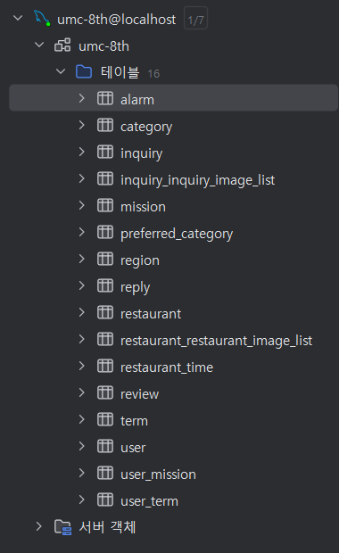

## 실습 미션



## 시니어 미션 1. 연관관계 매핑 및 최적화
- @OneToMany 조회 시, List와 Set의 차이점
    - List
      - 조회된 엔티티 간에 순서가 존재한다.
      - DB가 보내는 순서대로 리스트를 생성한다.
      - 엔티티의 중복을 허용한다.
    - Set
      - 순서가 존재하지 않는다.
      - 엔티티의 중복을 허용하지 않는다.
    - @OneToMany에서 List가 주로 쓰이는 이유
      - 지연로딩으로 두고 add()만 하는 경우, Set은 중복 검사를 위해 모든 엔티티를 조회하여 Lazy임에도 프록시를 강제 초기화한다.
      - 반면에 List는 add()를 하더라도 프록시를 초기화 하지 않는다.
      - 결국 지연로딩의 성능을 활용하지 못하여 성능 차이가 발생할 수 있다.


- orphanRemoval 적용 위치
  - 부모와 연관관계가 끊어진 자식 엔티티를 삭제해주는 옵션이다.
  - 자식이 딱 하나의 부모 엔티티에만 의존하는 경우 사용해야한다.
    - User-Alarm, User-Term, Restaurant-RestaurantTime, Review-Reply
```java
public class User {
	
	@OneToMany(mappedBy = "member", orphanRemoval = true, cascade = CascadeType.REMOVE)
	@Builder.Default
	private List<Alarm> alarmList = new ArrayList<>();

	@OneToMany(mappedBy = "user", orphanRemoval = true, cascade = CascadeType.REMOVE)
	@Builder.Default
	private List<UserTerm> userTermList = new ArrayList<>();
}

public class Restaurant {
	
	@OneToMany(mappedBy = "restaurant", orphanRemoval = true, cascade = CascadeType.REMOVE)
	@Builder.Default
	private List<RestaurantTime> restaurantTimeList = new ArrayList<>();
}

public class Review {
	@OneToOne(mappedBy = "review", orphanRemoval = true, cascade = CascadeType.REMOVE)
	private Reply reply;
}
```


## 시니어 미션 2. 트랜잭션 및 동시성 처리
- 여러 엔티티를 처리하는 비즈니스 로직 작성
  - 실습 코드에 User 삭제 시, 연관된 데이터를 한번에 삭제할 수 있도록 코드를 작성하였다.


- 여러가지 락킹 전략
  - 비관락
    - 데이터를 수정할 때, lock을 걸어 다른 트랜잭션이 접근하지 못하도록 하는 락킹 전략이다.
    - 충돌이 일어날 확률이 크다고 판단할 경우 사용할 수 있다.
    - 무결성은 보장되나, 성능 저하가 심하다.
    - 종류
      - S-lock : 읽기락, 다른 트랜잭션은 쓰기 X
      - X-lock : 쓰기락, 다른 트랜잭션은 쓰기 X, 읽기 X
      - S와 X간 데드락 상황을 이해하고 사용하는 것이 좋다.
    - 사용 방법
    ```java
    @Lock(LockModeType.PESSIMISTIC_WRITE)
    @Query("SELECT m FROM Mission m WHERE m.id = :id")
    Mission findByIdForUpdate(@Param("id") Long id);
    ```
    
  - 낙관락
    - 충돌이 거의 일어나지 않을 것으로 기대될 때 사용하는 락킹 전략이다.
    - 스프링에서는 버전관리 어노테이션을 지원하여, 수정을 하려는 시점에 충돌을 감지할 수 있다.
    - 충돌 발생을 처리하는 추가적인 코드를 작성해야 하는 단점이 있다.
    - 사용방법
    ```java
    public class Mission {
      @Id
      private Long id;

	  @Version
      private Long version; // 버전 필드 (커밋될 때마다 1씩 증가한다)
    }
    ```
    
  - 분산락
    - 주로 분산 서버 환경에서 공유 자원에 대한 충돌을 처리할 때 쓰이는 락 전략이다.
    - 외부 시스템(Redis, Zookeeper, MySQL ...)을 사용하여 락을 관리한다.
    - 추가적인 시스템을 학습하고 구축해야한다는 단점이 있다.
  

  - 락 적용 시 주의점
    - 반드시 비즈니스 로직이 커밋된 후에 락 해제가 보장되어야 한다.
    - 만약 비즈니스 트랜잭션에 락 해제가 함께 포함되어 있을 경우, 락 해제 후 커밋이 되는 시점에 다른 트랜잭션이 개입할 수 있어 동시성 이슈가 다시 발생하기 때문이다.
