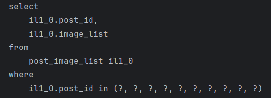

## 시니어 미션

1. readOnly = true 여부에 따른 조회 성능 측정
  - 간단한 측정을 위해 System.currentTimeMillis() 를 사용해 측정하고 로그를 확인하였다.
  - 실제 환경에서는 AOP를 사용하여 범용적으로 측정하도록 해야할 것이다.

  - 측정 대상 컨트롤러 코드
    ```java
    @Operation(summary = "아이디어 상세 조회 [GET]", description = "경로 변수로 아이디어 마켓 식별자 ID를 입력받아 상세 조회합니다.")
	@GetMapping("/{ideaId}")
	public ResponseEntity<ApiResponse<GetIdeaDetailDto.Response>> getIdeaDetail(...) {
		
		long start = System.currentTimeMillis();
		
		GetIdeaDetailDto.Response response = ideaMarketService.getIdeaDetail(parameter);
		
		long end = System.currentTimeMillis();
		log.info("getIdeaDetail 실행 시간: {}ms", (end - start));
		
		return ResponseEntity.ok(ApiResponse.success(response));
	}
    ```

  - 서비스 코드 요약
    ```java
    @Transactional(readOnly = true)
	public GetIdeaDetailDto.Response getIdeaDetail(GetIdeaDetailDto.Parameter parameter) {

		// 유저 조회...

		// 아이디어 조회...

		// 권한 처리...

		// 조회수 처리...

		// 작성자 조회...

		// 부가 정보 조회...

		return GetIdeaDetailDtoConverter.toResponse(ideaMarket, writer, saveCount, totalIdeas, totalCollaborations,
			isSavedPost, isMyPost);
	}
    ```

  - readOnly 적용 X
    - 
    - 
    - 

  - readOnly 적용 O
    - 
    - 
    - 

  - 평균적으로 10~20% 정도의 성능 개선이 가능함을 확인할 수 있었다.

  - readOnly = true의 역할
    1. 변경감지 비활성화 → 성능 최적화
    2. 변경 x → 데이터 무결성 보장
    3. 읽기 전용 여부를 보고 DB가 쿼리 계획을 최적화 가능
    4. 가독성 향상

  - 기존에는 단순히 가독성을 위해 붙이는 것이라 생각했으나, 공간 절약과 성능 및 가독성 향상이라는 이점을 모두 가져갈 수 있는 옵션임을 몸소 느낄 수 있었다.


2. @BatchSize를 적용한 성능 개선
  - 겪었던 문제 상황
    - 게시글에는 가격 정보, 작성자 정보, 썸네일 정보 등의 연관 엔티티가 많이 존재하여 N+1이 발생하였다.
    - 우선 고려한 것은 Fetch Join이었으나, 페이징이 요구되었기에 @BatchSize로 해결하였다.

  - 게시글 별 썸네일 정보를 @BatchSize로 해결
    - 

  - 이외에도 가격 정보와 작성자 정보 또한 @BatchSize를 적용하여 아래와 같은 성능 개선을 확인할 수 있었다.

  - 적용 전, 27개의 쿼리와 45ms의 실행 시간
    - 

  - 적용 후, 5개의 쿼리와 18ms의 실행 시간
    - 


3. 그 외 적용 가능한 최적화 방안
  - 데이터의 유형이 ‘개인/기업’의 ENUM 타입으로 나뉘어 하나의 테이블에서 관리되었다.
  - ‘개인’의 데이터만 필요한데, 기존 코드에서는 조회 쿼리를 쓰지 않고, @OneToMany로 접근한 후, for문을 필터링을 거쳤다.
  - 이 때문에 필요하지 않은 ‘기업’ 데이터까지 메모리에 모두 로드되었다.
  - 메모리 사용률 측면에서 비효율적일 수 있다.
  - 따라서 ‘**ENUM으로 관리되는 테이블에서 특정 유형만 필요한 경우**’ 에는 @OneToMany 필드로 접근하지 않고, 쿼리를 직접 작성하는 것이 좋을 것이다.