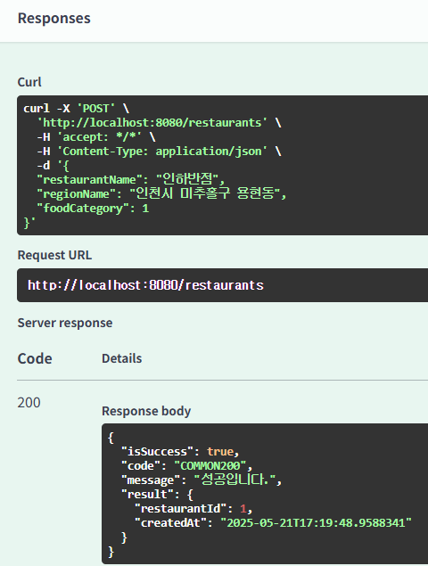
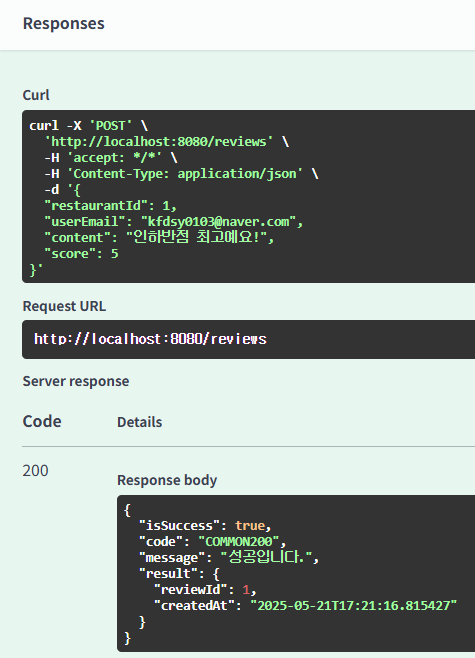
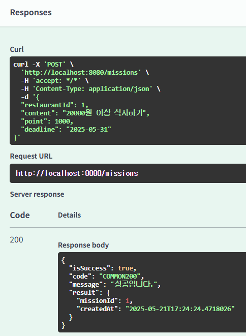
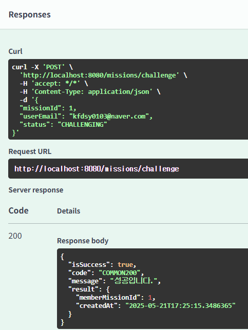

## 미션 1. 특정 지역에 가게 추가하기
- 

## 미션 2. 가게에 리뷰 추가하기
- 

## 미션 3. 가게에 미션 추가하기
- 

## 미션 4. 미션 도전하기
- 

## 시니어 미션 1. @DynamicInsert 및 @DynamicUpdate 내용 정리
- @DynamicInsert, @DynamicUpdate 적용 시 차이점
  - 해당 어노테이션을 적용하지 않은 경우, 엔티티를 insert/update할 때, JPA는 모든 필드를 대상으로 SQL 쿼리를 만들어낸다.
  - 따라서 null인 필드도 SQL에 함께 포함된다.
  - 반면 어노테이션을 적용할 경우 null 필드는 제외하고 SQL을 실행한다.
  - Insert : null이 아닌 필드만 SQL에 포함된다.
  - Update : 변경감지를 통해 변화가 일어난 필드만 SQL에 포함된다.

- 어노테이션 적용 시 단점
  - 장점 : 엔티티 삽입 시, 컬럼에 디폴트 값을 넣을 수 있다. 또한 필드가 많은 경우 쿼리 최적화 덕분에 성능이 향상될 수 있다.
  - 단점 : 생성되는 쿼리를 예측하기 어려워진다.

- 사용 시점
  - 기본값으로 지정해둔 컬럼이 많은 경우
  - 전체 컬럼 중에서 일부 컬럼만 쓰이는 엔티티
  - 필드가 너무 많아 쿼리를 최적화하는 경우

## 시니어 미션 2. Rest Docs 내용 정리
- Rest Docs란?
  - Spring 기반 REST API를 문서화하기 위한 라이브러리
  - 테스트 기반으로 동작하므로, 반드시 테스트 코드가 통과되어야 문서가 생성된다.
  - HTML 파일로 문서가 만들어진다.

- 스웨거와의 장단점
  - 스웨거는 테스트 코드가 없어도 된다.
  - 스웨거는 UI를 제공하나, Rest Docs는 HTML 문서만 제공한다.
  - 스웨거는 실시간으로 API 호출을 할 수 있다.
  - 설정은 Rest Docs가 더욱 어려우나, 안정적인 공식 문서를 배포하는 데에는 Rest Docs가 적합하다.

- 적용 시점
  - 스웨거 : 프론트와 협업 과정에서 빠르게 문서를 만들고, UI 기반으로 API의 동작을 공유 및 실행하고 싶은 경우
  - Rest Docs : 신뢰성있고, 품질이 중심이 되는 공식 문서가 중요한 경우 사용, 기업 프로젝트 등?